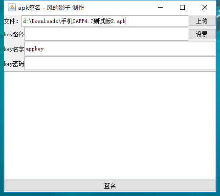

## apksigner

使用jar 编写的apk签名工具图形界面版，内核采用apksigner.jar，支持v2签名。

### 功能特点

- 将apk拖拽到 编辑框中即可自动填入apk路径
- 签名之后apk在原apk目录下
- 配置文件记录，下次启动不必重复填入信息

开源地址：https://github.com/fengdeyingzi/apksigner

jar下载：https://github.com/fengdeyingzi/apksigner/releases/